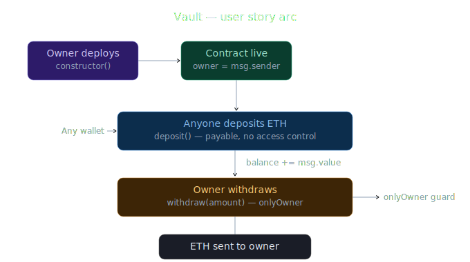
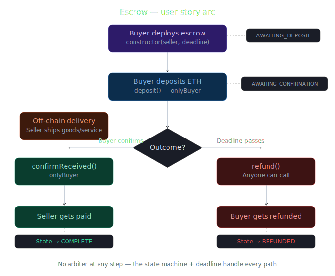

# Solidity Patterns: Vault → Escrow

A mid-level Solidity workshop demonstrating how the vault custody pattern naturally extends into arbiter-free escrow. Built for developers who know Web3 and Solidity basics and are ready to write production-grade contract patterns.

**Workshop conducted for [Cortex Global](https://x.com/cortaboratory)**

## Workshop Recording

[Watch the full workshop →](https://drive.google.com/file/d/1gJ0GNrN0fWkNqR4OKuYpla8y8kNOgbCB/view?usp=sharing)

---

## What You'll Learn

- The **vault pattern** — the atomic unit of on-chain custody (deposit, store, withdraw with access control)
- The **escrow pattern** — vault with conditional release using a finite state machine
- Why **deadlines replace arbiters** — deterministic, incorruptible, permissionless dispute resolution
- **Checks-effects-interactions** — reentrancy protection in practice
- **Design tradeoffs** — why removing the arbiter requires accepting asymmetry

---

## Contracts

### Vault

The simplest meaningful custody pattern in Solidity. One owner, anyone can deposit, only the owner can withdraw.

```
contracts/
└── Vault.sol
```

**Key concepts covered:**
- `msg.sender` as cryptographic identity
- `onlyOwner` modifier for access control
- `call{value}` over `transfer` (post-Istanbul)
- Events as the off-chain data layer

### Escrow

Vault extended with two parties, a state machine, and a deadline. No arbiter needed.

```
contracts/
└── Escrow.sol
```

**Key concepts covered:**
- `enum State` — explicit finite state machine
- `inState` modifier — FSM enforcement at the function level
- `block.timestamp` as the arbiter replacement
- Checks-effects-interactions pattern for reentrancy protection

---

## Flow Diagrams

### Vault



### Escrow



---

## The Core Insight

| Vault | Escrow |
|-------|--------|
| Single owner | Two parties (buyer + seller) |
| `onlyOwner` modifier | `onlyBuyer` + state machine |
| Unconditional withdraw | Conditional release (confirm OR timeout) |
| Implicit state (balance) | Explicit state enum (FSM) |
| Owner is the authority | Contract logic is the authority |

> **Vault** = "I trust code to hold my money."
>
> **Escrow** = "I trust code to hold my money *and* decide when to release it."
>
> The arbiter disappears because the state machine + deadline is a more reliable arbiter than any human.

---

## Why No Arbiter?

The traditional escrow model uses a trusted third party (arbiter) to resolve disputes. This contract eliminates the arbiter entirely through two mechanisms:

1. **Buyer-confirms model** — The buyer holds release power. If they received the goods, they call `confirmReceived()` and the seller gets paid.

2. **Deadline as fallback** — If the buyer goes silent or the seller never delivers, `block.timestamp >= deadline` opens the refund path. Anyone can call `refund()` after the deadline. No human intervention needed.

**The tradeoff:** This design is asymmetric — it favors the buyer. The seller's protection is pre-contractual: they inspect the escrow terms and choose whether to participate. If you require both parties to confirm, disagreements create deadlock, which *demands* an arbiter — reintroducing the trusted third party you were trying to eliminate.

---

## Exercises

These were assigned as the weekly build challenge for the mid-level cohort:

| Level | Challenge |
|-------|-----------|
| **Standard** | Add `extendDeadline()` — only the buyer can call it |
| **Stretch** | Multi-milestone escrow — deposit once, release in tranches |
| **Advanced** | ERC20 token escrow using `IERC20`, `transferFrom`, and approvals |

---

## How to Use

1. Open [Remix IDE](https://remix.ethereum.org)
2. Create new files and paste the Vault and Escrow contracts
3. Compile with Solidity `^0.8.20`
4. Deploy Vault first — experiment with deposit/withdraw
5. Deploy Escrow with a seller address and a deadline (`block.timestamp + 3600` for 1 hour)
6. Walk through the full lifecycle: deploy → deposit → confirm (or wait for deadline → refund)

---

## Tech Stack

- **Solidity** `^0.8.20`
- **Remix IDE** for deployment and testing
- Custom errors over require strings (gas-efficient)
- No external dependencies — pure Solidity

---

## License

MIT
